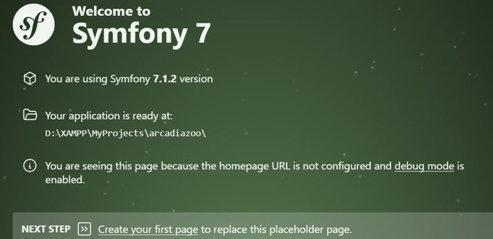
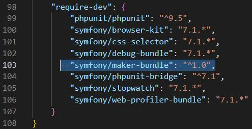
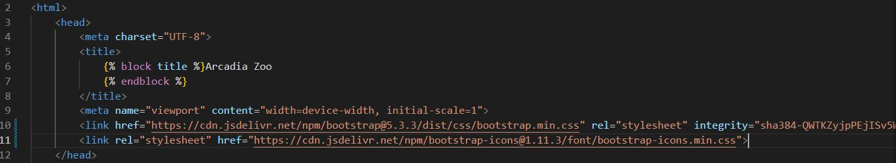
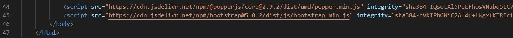
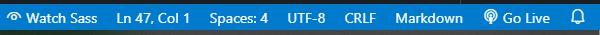
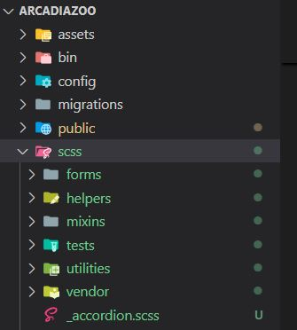
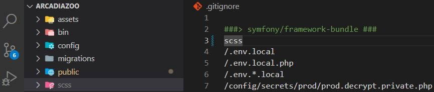

# Site Arcadia Zoo
## Environnement de travail

- PC Windows10
- Visual Studio Code
- Composer version 2.6.6
- PHP 8.3
- Symfony7
- Symfony CLI 5.8.11
- Bootstrap 5.3
  
## Installation de Symfony7
On a plusieurs manières d'installer Symfony7, j'ai choisi la manière plus simple via composer.
```
composer create-project symfony/skeleton:"7.1.*" arcadiazoo
cd arcadiazoo
composer require webapp
```
Maintenant le projet "arcadiazoo" est créé, j'ouvre ce projet avec Visual Studio Code, puis afficher la page de bienvenue de Symfony7, j'ouvre le terminal puis lancer la commande :
```php
symfony server:start
```

pour afficher cette dernière.



La page de bienvenue de Symfony est bien affichée mais je voulais créer ma page d'accueil en utilisant le Framework de Bootstrap, pour ce faire je dois créer un contrôleur associé à cette page. On a plusieurs manières pour créer un contrôleur je vais utiliser la plus simple le terminal via maker-bundle, pour pouvoir l'utiliser il faut qu'il soit installé dans le système, je vais vérifier dans "composer.json" le maker-bundle est bien installé, je peux maintenant lancer la commande pour créer ce contrôleur.



```
php bin/console make:controller HomeController
```
Le contrôleur "HomeController" est crée dans "src/Controller/HomeController.php" et dans "template/home/index.html.twig" je vais modifier le code de cette page pour faire la page d'accueil de mon projet, je vais d'abord intégrer le Framework de Bootstrap en même occasion j'intègre aussi Bootstrap-icons dans mon projet, je me rend à la documentation de Bootstrap, copier le lien via CDN et coller dans fichier "base.html.twig" entre la balise ouvrante et la balise fermante de "head" comme dans la capture d'écran ci-dessous.



Et le script je l'ai collé avant la balise fermante de body.



Avant de commencer à coder ma page d'accueil il me reste une chose important à faire, par rapport à la palette de couleur que j'ai déterminé dans Charte Graphique de "Figma", 
[Charte Graphique](https://www.figma.com/design/u9WRTomub3dcGjSojmiRNO/Arcadia-Zoo?node-id=18-4&t=y9DscXB5wf2WZbbh-0).  
Pour pouvoir l'utiliser je dois ajouter sass de Bootstrap dans mon projet.  
Pour compiler mes fichiers scss j'installe une extension "Live Sass Compiler" sur mon éditeur de texte Visual Studio Code, une fois installé j'ai un bouton "Watch Sass" sur la "Status Bar" qui se trouve en bas de l'éditeur, je dois cliquer sur ce bouton à chaque fois je veux compiler mes fichiers.



Pour Sass de Bootstrap, je télécharge les fichiers sources dans cet archive j'ai un répertoire "scss" je copie ce dernier et coller dans mon projet "arcadiazoo".  



Après avoir intégré ce répertoire "scss" je me trouve avec 113 changements, je ne peux pas envoyer tous ces fichiers sur GitHub je vais mettre ce répertoire "scss" dans .gitignore une fois c'est fait il me reste 6 changements et la couleur de ce répertoire à changé aussi, je vais commiter ces changements maintenant pour que tout soit propre.  




